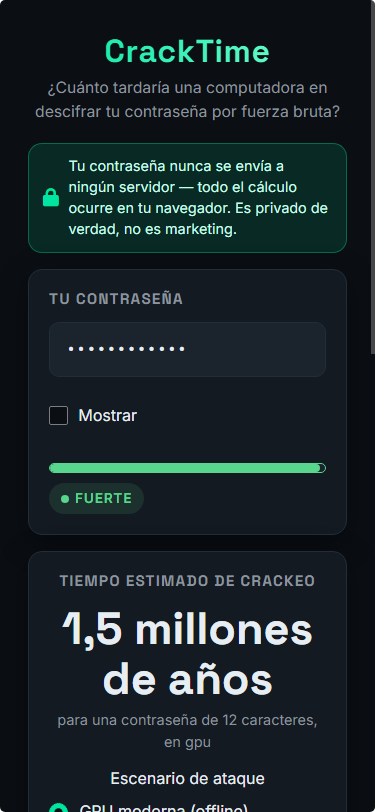
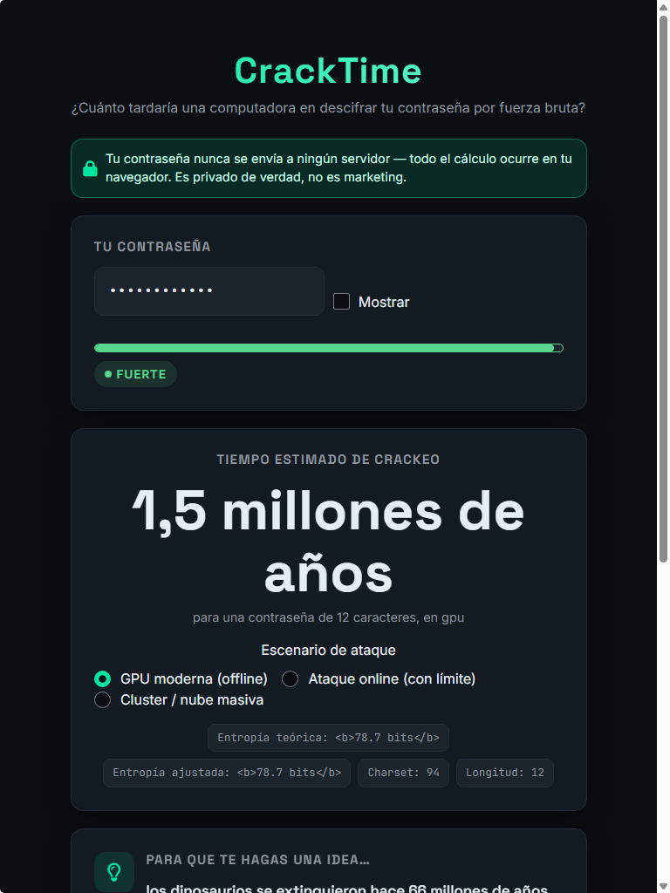
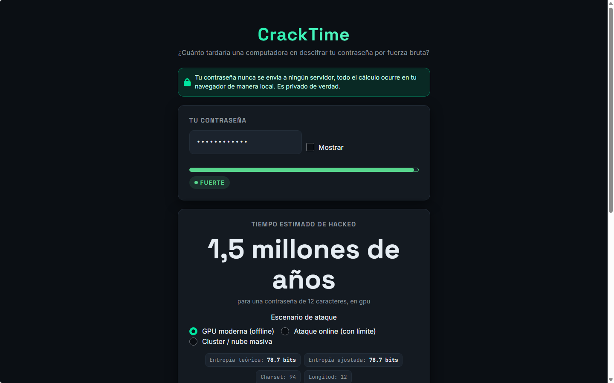

# CrackTime (PWTest)

Herramienta interactiva que estima en tiempo real cuánto tardaría una computadora
en descifrar una contraseña por fuerza bruta / ataque de diccionario.

> **Privacidad:** la contraseña ingresada **nunca** se envía a un servidor ni se
> almacena. Todo el cálculo corre 100 % client-side en el navegador
> (Shiny compilado a WebAssembly con Shinylive).

## Stack

| Capa | Tecnología |
|---|---|
| Lógica y cálculo | R (Shiny) |
| Compilación a estático | Shinylive (R → WebAssembly) |
| Hosting / Deploy | Vercel (deploy automático desde GitHub) |
| Control de versiones | Git + GitHub |
| Estilo visual | bslib + CSS custom |
| Cálculo de entropía | Lógica propia en R (sin librerías externas) |

## Versiones fijadas

| Componente | Versión |
|---|---|
| R | 4.6.1 |
| shiny | 1.14.0 |
| bslib | 0.12.0 |
| shinylive | 0.5.0 |
| renv | 1.2.4 |

> Las versiones exactas de todos los paquetes (incluidas las dependencias) están
> fijadas en `renv.lock` para reproducibilidad.

## Setup local

La app corre en modo Shiny normal (sin WASM) durante el desarrollo:

```r
# en la raíz del proyecto
renv::restore()   # si ya existe renv.lock
shiny::runApp("R/app.R")
```

## Estructura

```
PWTest/                 # raíz del repo (el prompt maestro la llama "pwtest")
├── app.R               # entrypoint: lanza la app (requerido por Shiny/Shinylive)
├── R/
│   ├── entropy.R       # lógica de cálculo de entropía y tiempo de crackeo
│   ├── patterns.R      # detección de patrones débiles / diccionario
│   ├── suggestions.R   # generación de sugerencias de mejora
│   ├── fun_facts.R     # comparaciones curiosas según tiempo estimado
│   └── app.R           # UI + server de la app Shiny (sourced desde app.R raíz)
├── tests/              # tests manuales de lógica y de la app
├── www/
│   ├── styles.css      # estilos custom
│   └── assets/         # íconos, og-image, favicon
├── docs/               # output compilado por Shinylive (deploy target)
├── screenshots/        # capturas del resultado (Fase 9)
├── .github/workflows/  # CI opcional para build automático
├── vercel.json
├── README.md
└── .gitignore
```

> **Nota de estructura (desvío justificado):** Shiny y shinylive exigen `app.R`
> en la raíz del directorio de la app, así que hay un `app.R` raíz (entrypoint)
> que hace `source("R/app.R")` y lanza `shinyApp(ui, server)`. La UI/server
> viven en `R/app.R` como define el prompt.

## Compilación a Shinylive (deploy)

Detallado en la Fase 6 del prompt maestro. El build se genera en `docs/` y se
sirve desde Vercel como sitio estático.

```r
Rscript tools/build-shinylive.R   # regenera docs/ (borra y exporta de cero)
```

### Paso manual después del primer deploy (meta tags OG)

Las meta tags `og:image`, `twitter:image` y `og:url` necesitan **URLs
absolutas** para que los scrapers (LinkedIn, WhatsApp, X) resuelvan la imagen.
El build las arma con la variable de entorno `SITE_URL`; si no está seteada,
queda un placeholder. Después del primer deploy en Vercel:

1. Copiar la URL real que asigna Vercel (ej. `https://pwtest-xyz.vercel.app`).
2. Regenerar el build seteando `SITE_URL`:
   - R: `Sys.setenv(SITE_URL = "https://<url-real>.vercel.app"); source("tools/build-shinylive.R")`
   - o PowerShell: `$env:SITE_URL = "https://<url-real>.vercel.app"; Rscript tools/build-shinylive.R`
3. Commitear y pushear el `docs/` actualizado.
4. Verificar el preview con el debugger de Facebook (Sharing Debugger) o pegando
   el link en un chat de prueba de LinkedIn.

> **Por qué staging:** `shinylive::export()` empaqueta **todos** los archivos del
> directorio origen. Si se exportara la raíz del repo, se incluiría `renv/`
> (la biblioteca R, cientos de MB) en `app.json`. El script copia solo
> `app.R`, `R/` y `www/` a un staging temporal y exporta desde ahí.

### Tipografías embebidas (requisito webR)

Las fuentes (Inter, Space Grotesk, JetBrains Mono) están **embebidas** en
`www/fonts/` y declaradas con `@font-face` en `styles.css`. **No** se usa
`bslib::font_google()`: webR no tiene curl/libcurl y el intento de descargar
fuentes en runtime rompe el render de la app en Shinylive.

### Verificación local del build estático (sin R activo)

```bash
python -m http.server 8000 --directory docs
# abrir http://localhost:8000  (la app entera corre client-side en WASM)
```

`python -m http.server` no manda los headers COEP/COOP; la app igual funciona
(webR cae a modo single-thread). En producción Vercel los manda
(`vercel.json`). Para probar con headers: `python tools/serve_headers.py` desde
`docs/`.

### Medidas documentadas (Fase 6, primera carga)

| Métrica | Valor |
|---|---|
| Tamaño total `docs/` | ≈ 65 MB |
| Ruta crítica (WASM + paquetes) | ≈ 32 MB (`R.wasm` 17.2 MB + `library.data.gz` 14.4 MB + `R.js`) |
| Primer arranque en frío (headless, cold) | ~2–3 min hasta UI interactiva |
| Cargas posteriores (SW/cache) | ~6 s hasta UI interactiva |
| Bundle de la app (`app.json`) | 114.7 KB (9 archivos, UTF-8 válido) |

> La medición oficial con DevTools (Network, throttling 3G/4G) se documenta en
> la Fase 7, junto con las optimizaciones de carga (precarga, SW, compresión).

## Optimización de carga (Fase 7)

La primera carga de Shinylive es pesada (runtime completo de R en WASM). Las
mitigaciones implementadas, aplicadas al **shell estático** (`docs/index.html`
post-procesado por `tools/build-shinylive.R`):

1. **Pantalla de carga con identidad** (`tools/loading-screen.html`): se inyecta
   en el `index.html` estático → visible **desde el primer render** (antes de
   que R exista), con mensajes rotativos ("descargando runtime…", "compilando
   WebAssembly…"). Se oculta cuando la app real aparece en el iframe (detección
   de `#password`), con fallback a 60 s. Crawlers (LinkedIn) también ven el
   `<title>`, metas og/twitter y el `og-image.png` real (antes estaban solo
   dentro de la app WASM, invisible para el scraping).
2. **Precarga temprana:** `<link rel="preload" crossorigin>` de `R.wasm`
   (17.2 MB) y `library.data.gz` (14.4 MB) en el `<head>`. El `crossorigin`
   es obligatorio: webR fetchea con `credentials:"same-origin"` (modo CORS);
   sin él el navegador haría una segunda descarga. Verificado: único fetch
   (initiatorType `link`).
3. **Service Worker:** shinylive incluye `shinylive-sw.js` (cachea todos los
   assets, incluido el runtime). Verificado: `ServiceWorkerRegistration`
   registrada. Las visitas repetidas no vuelven a descargar los ~32 MB.
4. **Compresión:** Vercel sirve gzip/brotli automáticamente. Verificar en
   DevTools → Network → `Content-Encoding` tras el deploy (Fase 8).
5. **Cross-origin isolation:** `vercel.json` ahora aplica COEP/COOP a
   **toda** la página (`/(.*)`), no solo a `/shinylive/*`. Sin esto en la
   raíz, webR no tiene `SharedArrayBuffer` y corre single-thread (más lento).

### TTI medido (entorno headless de desarrollo, no representativo de red real)

| Escenario | TTI hasta interactividad |
|---|---|
| Fase 6 (sin preload, sin loader) — frío | ~180 s (contaminado por actividad paralela) |
| Fase 7 con preload — frío, localhost | ~7 s |
| Fase 7 con preload — 4G simulado (1.6 MB/s) | ~32 s |
| Fase 7 con SW — visita repetida | ~6 s |

**Objetivos a confirmar en DevTools (red real, máquina real):**
- Primera visita en 4G: **TTI < 20 s** (la transferencia crítica es ~32 MB).
- Visita repetida (SW): **TTI < 5 s**.

**Procedimiento DevTools (4G):** Network tab → throttling "Slow 4G"/"Fast 4G" →
recargar → medir hasta que el campo de contraseña sea usable (Time to
Interactive). Verificar también `Content-Encoding: gzip/brotli` y, en
Application → Service Workers, la SW activa.

> **Pendiente deploy:** el `og:image` usa ruta relativa; al conocer la URL
> final de Vercel conviene fijarla absoluta (recomendable para LinkedIn).

## QA final (Fase 9)

Validación integral sobre el build estático (`docs/`) servido con headers
COEP/COOP, automatizada con Chrome/Edge headless + CDP.

### Privacidad (crítico)

Con `Network` activo durante boot + interacción, **cero requests salen del
navegador** al escribir contraseñas: los 39 requests capturados apuntan al
propio origen; los 2 restantes son `data:` URIs inline (iconos SVG) que nunca
tocan la red. Ningún request contiene la contraseña. Todo el cálculo ocurre en
webR (WASM) dentro del iframe.

### Funcional (12 contraseñas variadas)

| Contraseña | Hero | Fortaleza |
|---|---|---|
| `""` (vacía) | … | "Escribí una contraseña" (sin crash) |
| `a` | instantáneo | débil |
| `123456` | instantáneo | débil |
| `password` | instantáneo | débil |
| `P@ssw0rd` | instantáneo | débil |
| `correct horse battery staple` | más que la edad del universo | muy fuerte |
| `Xk3#f9q2!aB5` | 1,5 millones de años | fuerte |
| `Tr0p1cal*2026` | 140 millones de años | muy fuerte |
| `pässwörd🔐123` (unicode) | 12 días | media |
| `AAAAAAAAAAAAAAAAAAAA` | instantáneo | débil |
| `1990-05-14` (fecha) | 20 días | media |
| `qwertyuiop` | instantáneo | débil |

Pegar una contraseña dispara los mismos eventos `input` que teclearla (Shiny no
los distingue). Cero errores de consola en toda la sesión.

### Toggle mostrar/ocultar

Reescrito en Fase 9 como **cambio 100% client-side** (listener `change` sobre
`#mostrar` basado en `cb.checked`). El motivo: el binding de Shiny deja el
`.type` (propiedad) desincronizado del atributo (`password` vs `text`), y la
versión anterior vía `sendCustomMessage` alternaba "un click atrasado". El
texto del label sigue server-driven (`updateCheckboxInput`). Verificado:
click → `text`/Ocultar → click → `password`/Mostrar.

### Accesibilidad

- El input ahora lleva `aria-label="Tu contraseña"` (inyectado al tag en `R/app.R`).
- La fortaleza no depende solo del color: el `.fuerza-chip` muestra el texto
  ("débil"/"media"/"fuerte"/"muy fuerte").

### Responsive

Sin overflow horizontal en 375 / 768 / 1440 px (verificado por CDP):

| Screenshot | |
|---|---|
| Mobile 375px |  |
| Tablet 768px |  |
| Desktop 1440px |  |

### Cross-browser

Chrome y Edge (headless) con resultado idéntico y cero errores. Firefox y
Safari quedan para verificación manual del usuario antes del lanzamiento
(WASM puede comportarse distinto).

> **Pendientes de verificación manual (requieren deploy):** preview social en
> LinkedIn (Post Inspector), compresión `Content-Encoding` en Vercel y TTI real
> con DevTools en red/equipo real.

## Tests de la lógica (Fase 2)

Casos de prueba manuales verificados:

```r
Rscript tests/manual_tests.R
```

| Caso | Contraseña | Resultado esperado |
|---|---|---|
| Vacía | `""` | Manejo especial, "contraseña vacía" |
| 1 carácter | `a` | Instantáneo |
| Patrón obvio | `123456` | Secuencia numérica → instantáneo, ajustada << teórica |
| Leetspeak | `P@ssw0rd` | Diccionario detectado tras normalizar → instantáneo |
| Diccionario + números | `password123` | Tope honesto (~8 bits) |
| Secuencia de teclado | `qwerty123` | Tope honesto (~8 bits) |
| Repetición | `aaa111bbb` | Repeticiones penalizadas |
| Fuerte aleatoria | `Xk3#f9q2!aB5z` | ~85 bits → cientos de millones de años |
| Muy larga (60 chars) | (aleatoria) | Sin overflow (escala logarítmica) |
| Solo Unicode | `😀😂` | No se asume un charset (ajustada = NA) |

Detalles del modelo (velocidad de ataque, penalizaciones, umbrales) en los
comentarios de `R/entropy.R` y `R/patterns.R`.

## Tests de sugerencias y datos curiosos (Fase 3)

```r
Rscript tests/manual_tests_fase3.R
```

- Cada regla de sugerencia (diccionario, leetspeak, secuencia, repetición,
  sin símbolos, longitud corta, positiva) con su caso de prueba.
- Las sugerencias muestran ANTES → DESPUÉS con números recalculados reales.
- Las comparaciones curiosas cubren todo el rango (log10 s de -4 a 18+), sin
  huecos, y se verifica que no usen referencias sensibles/catastróficas.

## Tests de la app (Fase 4)

```r
Rscript tests/test_app.R
```

- Lógica pura `calcular_resultado()` con 8 contraseñas variadas (vacía, corta,
  patrón, leetspeak, fuerte, diccionario, unicode, larga).
- Escenarios de hardware (gpu/online/cluster) recalculan el tiempo.
- Umbrales de fortaleza (débil/media/fuerte/muy fuerte) sobre la entropía
  ajustada.
- Reactividad del server vía `testServer()`.
- UI: input con `type=password`, toggle mostrar/ocultar, mensaje de privacidad
  siempre visible, selector de escenario, botón de compartir.